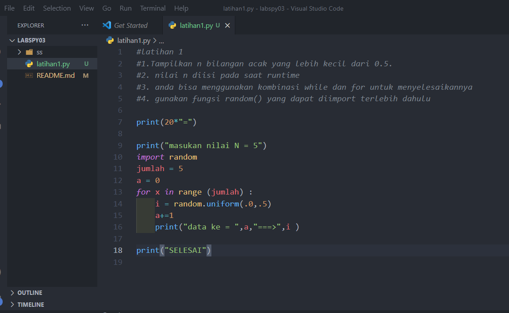
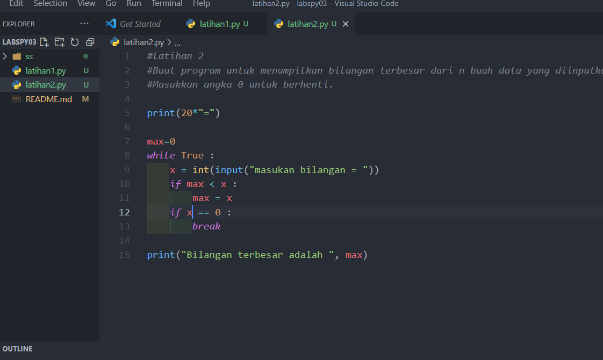

# labspy03

* PENJELASAN DARI PROGRAM
===========================================

* LATIHAN 1

* Berikut penjelasan dari program diatas
print ('Masukkan nilai N: 5')

import random

jumlah = 5

a = 0

for x in range(jumlah):

i = random.uniform(.0,.5)

a+=1

print('data ke:',a,'==>', i)

print ('selesai')

"print" : berfungsi untuk mencetak atau menampilkan objek ke perangkat keluaran (layar) atau ke file teks.

"import" : fungsi lanjut yang dipanggil oleh statement import.

"random" : untuk menentukan suatu pilihan.

"range" : merupakan fungsi yang menghasilkan list. Fungsi ini akan menciptakan sebuah list baru dengan rentang nilai tertentu.

"uniform": digunakan untuk menampilkan bilangan float random dengan batas awal bilangan x, dan batas akhir bilangan y.

===========================================

* LATIHAN 2

* Berikut penjelas Latihan2.py
max=0

while True:

a=int(input('Masukkan bilangan='))

if max < a:

max = a

if a==0:

break

print('Bilangan terbesarnya adalah',max)

"max" : fungsi bulid-in untuk mencari nilai tertinggi. Fungsi ini dapat diberikan sebuah parameter berupa angka.

"while" : disebut uncounted loop (perulangan yang tak terhitung), untuk perulangan yang memiliki syarat dan tidak tentu berapa banyak perulangannya.

"int" : berfungsi mengkonversi bilangan maupun string angka menjadi bilangan bulat (integer).

"if" = Bila suatu kondisi tertentu tercapai maka apa yang harus dilakukan. Dengan fungsi ini kita bisa menjalankan suatu perintah dalam kondisi tertentu.

"input" : masukan yang kita berikan ke program.

"break" : fungsi yang menghentikan operasi dibawahnya jika suatu kondisi yang ditentukan telah tercapai.

"print" : berfungsi untuk mencetak atau menampilkan objek ke perangkat keluaran (layar) atau ke file teks.

===========================================
